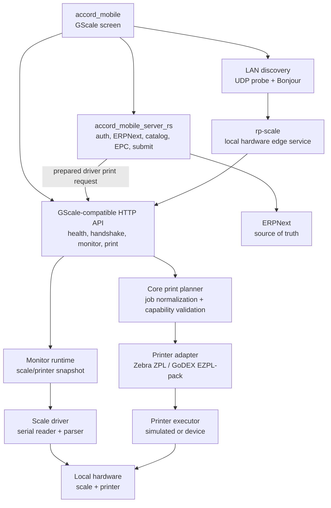
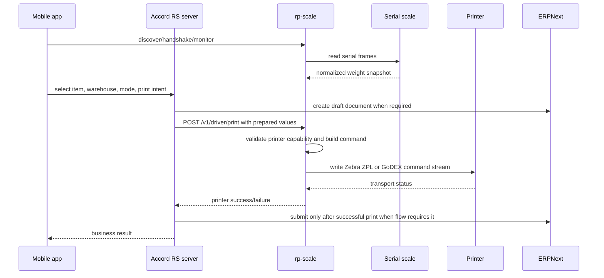

# rp-scale

`rp-scale` is the local hardware edge service for Accord/GScale scale and
printer workflows. It runs on the mini PC near the scale and printer, exposes a
GScale-compatible mobile discovery/monitor API, reads scale data, and executes
prepared printer jobs received from the Accord mobile backend.

The service is intentionally small and hardware-focused. It does not own
ERPNext credentials, item search, warehouse selection, user login, or business
document submission. Those responsibilities stay in `accord_mobile_server_rs`.

## Current Production Role

`rp-scale` is the hardware driver process used by mobile GScale flows:

- announces itself on the LAN using GScale-compatible discovery;
- exposes health, handshake, monitor, and printer capability endpoints;
- reads a serial scale when configured;
- reports current scale and printer state to the mobile app;
- prepares print commands through a typed core pipeline;
- prints to Zebra or GoDEX through the configured local device path;
- rejects unsupported printer modes instead of silently falling back.

The production split is:

- `accord_mobile_server_rs`: auth, ERPNext, catalog, item/warehouse selection,
  EPC generation, Stock Entry/Purchase Receipt writes, submit flow, and business
  validation.
- `rp-scale`: LAN discovery, scale state, printer capabilities, printer command
  generation, and local hardware execution.
- `accord_mobile`: user interface that talks to the Accord server for business
  data and to `rp-scale` for local hardware state/printing.

## Quick Start

Build and test:

```bash
cargo fmt --check
cargo test --locked
cargo build --release --locked
```

Run in simulated print mode:

```bash
RP_SCALE_SERVER_NAME=rp-scale-5070 \
RP_SCALE_SERVER_REF=rp-scale-5070 \
RP_SCALE_PRINTER=godex \
RP_SCALE_PRINT_EXECUTOR=simulated \
cargo run --release --locked -- serve
```

Run against real local hardware:

```bash
RP_SCALE_SERVER_NAME=rp-scale-5070 \
RP_SCALE_SERVER_REF=rp-scale-5070 \
RP_SCALE_PRINTER=godex \
RP_SCALE_PRINT_EXECUTOR=device \
RP_SCALE_GODEX_DEVICE=/dev/usb/lp0 \
RP_SCALE_SCALE_DEVICE=/dev/ttyUSB0 \
RP_SCALE_SCALE_BAUD=9600 \
RP_SCALE_SCALE_UNIT=kg \
target/release/rp-scale serve
```

Default HTTP candidate ports are `39117`, `41257`, `43391`, `45533`, and
`47681`. The first available candidate is selected unless
`RP_SCALE_MOBILE_API_ADDR` is set.

## System Architecture



## Runtime Request Flow



## Responsibilities

### rp-scale owns

- hardware discovery identity;
- mobile-compatible handshake and monitor payloads;
- scale serial connection and reconnect loop;
- scale frame parsing and normalized readings;
- stable weight observation;
- printer capability manifest;
- print request validation against printer capability;
- Zebra RFID/label command generation;
- GoDEX label/QR/barcode command generation;
- local printer transport execution.

### rp-scale does not own

- ERPNext API keys or secrets;
- ERPNext REST writes/submits;
- MariaDB/direct DB reads;
- item search and warehouse search;
- user login, sessions, roles, or permissions;
- admin settings and long-term business archive;
- Stock Entry/Purchase Receipt/Delivery Note business state.

This boundary keeps `rp-scale` deployable as a factory hardware agent without
turning it into a second ERP backend.

## Mobile API Surface

Implemented driver endpoints:

| Method | Path | Purpose |
| --- | --- | --- |
| `GET` | `/healthz` | Liveness response. |
| `GET` | `/v1/mobile/handshake` | GScale-compatible service identity. |
| `GET` | `/v1/mobile/printer/capabilities` | Active printer capability manifest. |
| `GET` | `/v1/mobile/monitor/state` | Current scale/printer/batch snapshot. |
| `GET` | `/v1/mobile/monitor/stream` | SSE monitor snapshots. |
| `GET` | `/v1/mobile/batch/state` | Local inactive driver batch state. |
| `POST` | `/v1/driver/print` | Prepared driver print request. |
| `POST` | `/v1/mobile/driver/print` | Mobile-compatible alias for driver print. |

Compatibility placeholders:

| Method | Path | Behavior |
| --- | --- | --- |
| `GET` | `/v1/mobile/setup/status` | Returns driver-scope setup status. |
| `POST` | `/v1/mobile/setup/warehouse` | Returns driver-scope setup status. |
| `GET` | `/v1/mobile/items` | Returns an empty driver-scope catalog response. |
| `GET` | `/v1/mobile/items/{item_code}/warehouses` | Returns an empty driver-scope warehouse response. |
| `GET` | `/v1/mobile/warehouses` | Returns an empty driver-scope warehouse response. |
| `GET` | `/v1/mobile/archive` | Returns an empty driver-scope archive response. |

Batch business endpoints such as `/v1/mobile/batch/start`,
`/v1/mobile/batch/manual-print`, and `/v1/mobile/batch/stop` return
`driver_batch_not_supported` in this driver service. Business batch state is
owned by the Accord server.

## Discovery

`rp-scale` supports two discovery mechanisms:

- UDP probe on discovery port `18081` with probe text `GSCALE_DISCOVER_V1`.
- Bonjour/mDNS service type `_gscale-mobileapi._tcp.local.`.

Discovery and handshake keep the GScale mobile shape:

- `service=mobileapi`
- `app=gscale-zebra`
- `server_name`
- `server_ref`
- `display_name`
- `role`
- `http_port`
- `discovery_port`
- `candidate_ports`
- mobile path fields for compatibility
- `requires_auth=false`

## Scale Runtime

The current production-compatible scale driver is serial.

Runtime behavior:

- opens the configured serial device;
- reads frames split by `\r` or `\n`;
- parses weights using the production-compatible parser;
- recognizes stable/unstable markers such as `ST`, `STABLE`, `US`, and
  `UNSTABLE`;
- normalizes missing units to the configured unit, defaulting to `kg`;
- records errors into monitor state instead of crashing the service;
- reconnects after open/read failures.

Stable tracking is observation only. It reports `NoWeight`, `Moving`, `Holding`,
`Ready`, or `Error`. It does not force manufacturing workflow rules such as
zero-crossing or previous-weight drop.

Useful diagnostic binaries:

```bash
cargo run --bin rp-scale-sim-scale -- --scenario batch
cargo run --bin rp-scale-probe-serial -- /dev/ttyUSB0 9600 3000 kg
cargo run --bin rp-scale-read-serial -- /dev/ttyUSB0 9600 kg 20 5000
```

## Print Pipeline

Printing is split into four layers:

1. Driver print request parses the JSON request from the Accord server.
2. Core print planner normalizes item, warehouse, quantity, tare, printer, mode,
   and EPC values.
3. Printer capability validation rejects unsupported modes.
4. Printer adapter builds Zebra or GoDEX command output and the executor writes
   it to a simulated or real device.

Supported printer families:

| Printer | Thermal label | RFID EPC write | Barcode | QR | Verify after print |
| --- | ---: | ---: | ---: | ---: | ---: |
| Zebra RFID | yes | yes | yes | no | yes |
| GoDEX G500 | yes | no | yes | yes | no |

Important rule: unsupported modes fail explicitly. For example, GoDEX RFID
requests are rejected because GoDEX does not support RFID EPC writing in this
driver.

## Driver Print Request

`POST /v1/driver/print` accepts a prepared hardware print request. Required
fields:

- `epc`
- `item_code`
- `warehouse`
- one positive quantity: `gross_qty`, `manual_qty_kg`, or `qty`

Common optional fields:

- `item_name`
- `printer`
- `print_mode` or `mode`
- `unit`
- `tare_enabled` or `tare`
- `tare_kg`

Example:

```json
{
  "epc": "3034257BF7194E406994036B",
  "item_code": "ITEM-1",
  "item_name": "Green Tea",
  "warehouse": "Stores - A",
  "printer": "godex",
  "print_mode": "label_only",
  "gross_qty": 2.5,
  "tare_enabled": false,
  "tare_kg": 0
}
```

Successful response includes the final normalized quantities, printer, mode,
and transport status.

## Configuration

Configuration is read from environment variables at process start.

| Variable | Default | Description |
| --- | --- | --- |
| `RP_SCALE_MOBILE_API_ADDR` | first free candidate port | Explicit HTTP bind address, for example `0.0.0.0:39117`. |
| `RP_SCALE_MOBILE_API_CANDIDATE_PORTS` | `39117,41257,43391,45533,47681` | Comma-separated candidate HTTP ports. |
| `RP_SCALE_SERVER_NAME` | `rp-scale` | Discovery and handshake server name. |
| `RP_SCALE_SERVER_REF` | derived from server name and port | Stable server reference shown to mobile clients. |
| `RP_SCALE_PRINTER` | `zebra` | Active printer: `zebra` or `godex`. |
| `RP_SCALE_PRINT_EXECUTOR` | unset | `simulated`, `dry-run`, `device`, `hardware`, `godex-device`, or `zebra-device`. |
| `RP_SCALE_ZEBRA_DEVICE` | unset | Local Zebra device path when device executor is enabled. |
| `RP_SCALE_GODEX_DEVICE` | unset | Local GoDEX device path when device executor is enabled. |
| `RP_SCALE_SCALE_DEVICE` | unset | Serial scale device path. If absent, scale reader is not started. |
| `RP_SCALE_SCALE_BAUD` | `9600` | Serial scale baud rate. |
| `RP_SCALE_SCALE_UNIT` | `kg` | Fallback unit for scale frames without unit text. |

## Linux Production Service

Recommended production shape on the mini PC:

1. Build the Linux binary on the build machine or directly on the mini PC.
2. Copy the binary to `/opt/rp-scale/rp-scale`.
3. Create `/etc/rp-scale.env` with hardware-specific variables.
4. Run through `systemd` so the driver starts after boot.

Example environment file:

```env
RP_SCALE_SERVER_NAME=rp-scale-5070
RP_SCALE_SERVER_REF=rp-scale-5070
RP_SCALE_MOBILE_API_ADDR=0.0.0.0:39117
RP_SCALE_PRINTER=godex
RP_SCALE_PRINT_EXECUTOR=device
RP_SCALE_GODEX_DEVICE=/dev/usb/lp0
RP_SCALE_SCALE_DEVICE=/dev/ttyUSB0
RP_SCALE_SCALE_BAUD=9600
RP_SCALE_SCALE_UNIT=kg
```

Example service unit:

```ini
[Unit]
Description=RP Scale local hardware service
After=network-online.target
Wants=network-online.target

[Service]
Type=simple
EnvironmentFile=/etc/rp-scale.env
ExecStart=/opt/rp-scale/rp-scale serve
Restart=always
RestartSec=2
User=rp-scale
Group=lp
SupplementaryGroups=dialout lp
WorkingDirectory=/opt/rp-scale

[Install]
WantedBy=multi-user.target
```

After install:

```bash
sudo systemctl daemon-reload
sudo systemctl enable --now rp-scale
sudo systemctl status rp-scale --no-pager
curl http://127.0.0.1:39117/healthz
```

## Development And Verification

Fast local verification:

```bash
cargo fmt --check
cargo test --locked
```

Contract tests that use the Python PTY simulator:

```bash
cargo build --bins
python3 -m pytest tests/contract
```

Useful manual smoke checks:

```bash
curl http://127.0.0.1:39117/healthz
curl http://127.0.0.1:39117/v1/mobile/handshake
curl http://127.0.0.1:39117/v1/mobile/printer/capabilities
curl http://127.0.0.1:39117/v1/mobile/monitor/state
```

Simulated print smoke:

```bash
RP_SCALE_PRINT_EXECUTOR=simulated \
RP_SCALE_PRINTER=godex \
cargo run --release --locked -- serve
```

Then send a prepared print request from another terminal:

```bash
curl -X POST http://127.0.0.1:39117/v1/driver/print \
  -H 'Content-Type: application/json' \
  -d '{
    "epc":"3034257BF7194E406994036B",
    "item_code":"ITEM-1",
    "item_name":"Green Tea",
    "warehouse":"Stores - A",
    "printer":"godex",
    "gross_qty":2.5,
    "tare_enabled":false
  }'
```

## Project Layout

```text
src/
  main.rs                 Process entrypoint and runtime wiring.
  core/                   Print intent normalization and core validation.
  scale/                  Scale reading model, parser, stable tracker, serial driver.
  print/                  Printer capabilities, adapters, Zebra, GoDEX, EPC helpers.
  runtime/                Core-to-printer print pipeline.
  service/                Discovery, Bonjour, HTTP, monitor, driver print API.
  bin/                    Scale simulator and serial diagnostics.
docs/
  migration_instructions.md
  mobile_api_scope.md
  printer_driver_contract.md
  scale_contract.md
tests/contract/
  Python PTY and serial contract tests.
```

## Design Rules

- Keep `rp-scale` hardware-focused; do not add ERP ownership here.
- Preserve GScale-compatible mobile discovery and monitor payload shape.
- Keep hot-path state typed and in memory, not JSON-backed.
- Add new printer or scale support through capability/driver boundaries.
- Reject unsupported hardware modes explicitly.
- Do not make zero-crossing a global scale rule.
- Do not require manual mobile changes for discovery compatibility.
- Keep files focused and split modules before they become large.

## Related Documents

- [docs/mobile_api_scope.md](docs/mobile_api_scope.md)
- [docs/scale_contract.md](docs/scale_contract.md)
- [docs/printer_driver_contract.md](docs/printer_driver_contract.md)
- [docs/migration_instructions.md](docs/migration_instructions.md)
